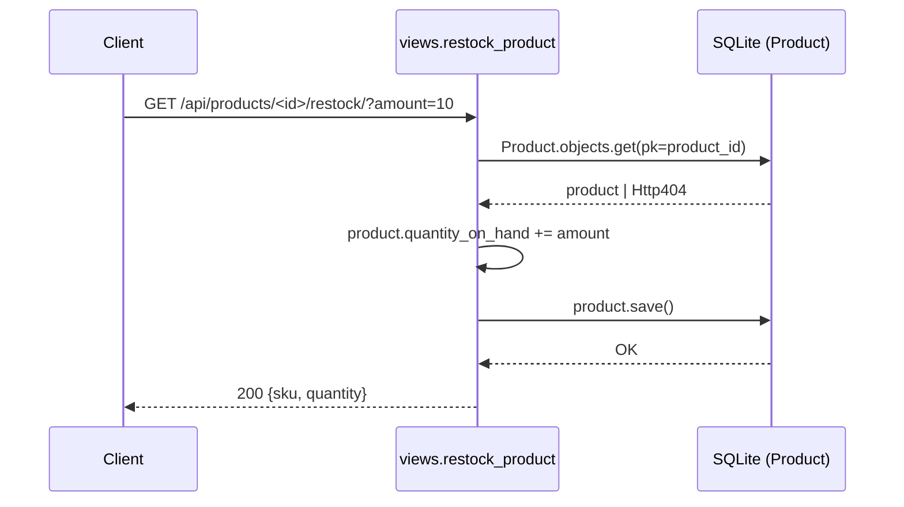
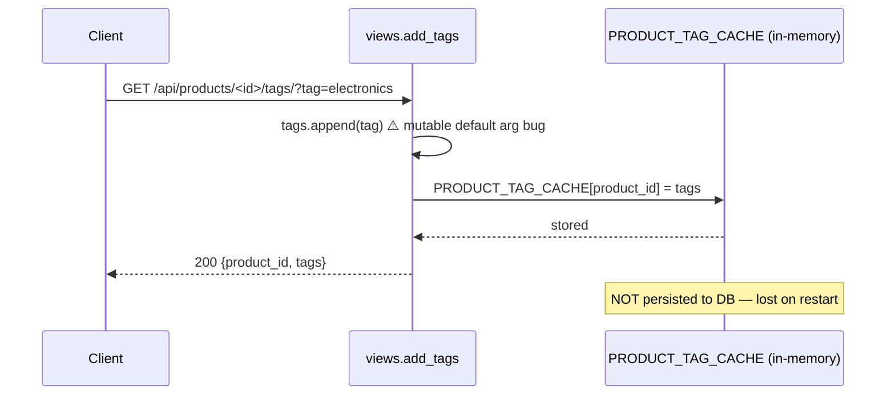
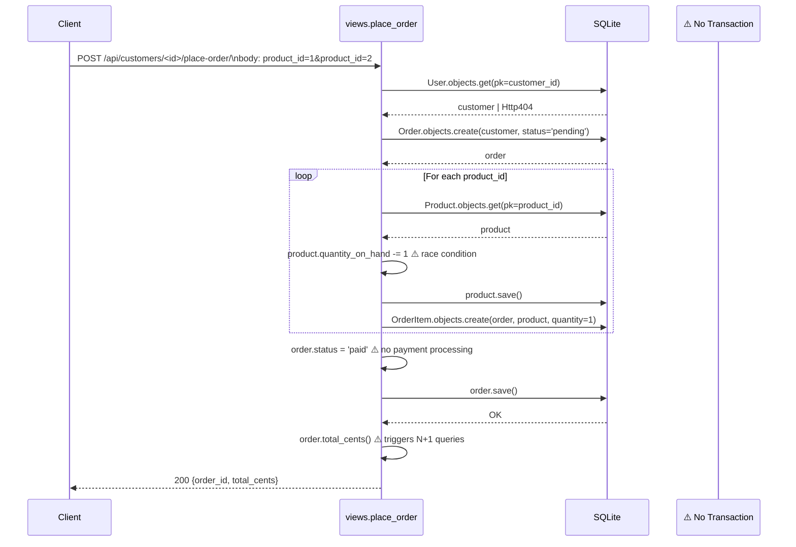
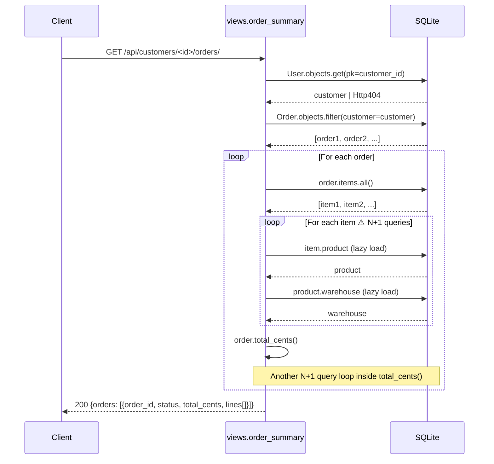
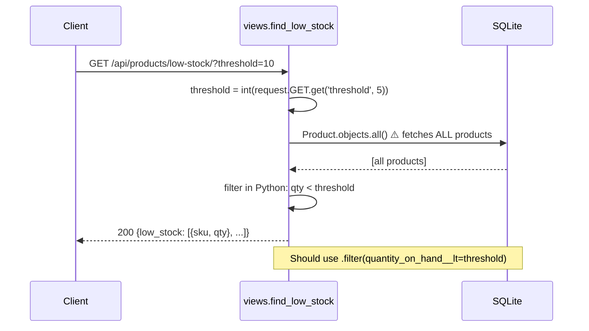
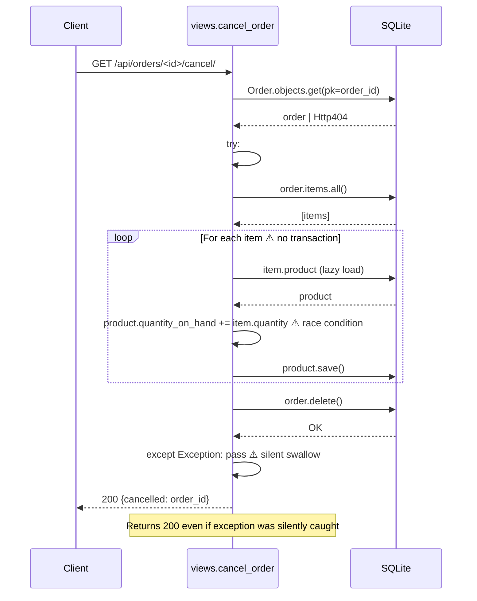
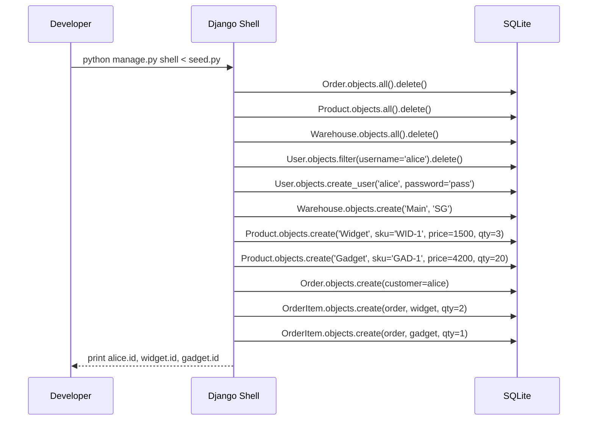

# Codebase Analysis: Inventory Service

---

## 1. Key Entry Points

| File | Purpose | Detail |
|------|---------|--------|
| `manage.py` | Django CLI entry point | Sets `DJANGO_SETTINGS_MODULE=config.settings`, delegates to `execute_from_command_line()` |
| `config/urls.py:4` | Root URL router | Mounts `inventory.urls` under `/api/` prefix |
| `inventory/urls.py` | API route definitions | 6 endpoints mapped to view functions |
| `seed.py` | Dev DB seeder | Run via `python manage.py shell < seed.py`; clears + rebuilds fixture data |

**API Endpoints (all under `/api/`):**

```
GET  /products/<id>/restock/?amount=<n>       → restock_product
GET  /products/<id>/tags/?tag=<name>           → add_tags
POST /customers/<id>/place-order/              → place_order
GET  /customers/<id>/orders/                   → order_summary
GET  /products/low-stock/?threshold=<n>        → find_low_stock
GET  /orders/<id>/cancel/                      → cancel_order
```

---

## 2. Key Functions — Hard Core of the Codebase

### `inventory/views.py`

| Function | Lines | Role |
|----------|-------|------|
| `restock_product(request, product_id)` | 13–21 | Increments `quantity_on_hand` by GET param `amount`; saves to DB |
| `order_summary(request, customer_id)` | 24–49 | Fetches all orders + items for a customer; calls `order.total_cents()` per order |
| `add_tags(request, product_id, tags=[])` | 52–58 | Appends a tag to module-level `PRODUCT_TAG_CACHE`; **not persisted to DB** |
| `place_order(request, customer_id)` | 64–81 | Creates Order + OrderItems; decrements stock by 1 per product; sets status=`paid` immediately |
| `find_low_stock(request)` | 84–95 | Fetches **all** products then filters in Python (should use ORM filter) |
| `cancel_order(request, order_id)` | 98–109 | Restores stock per item, deletes order; **swallows all exceptions silently** |

### `inventory/services.py`

| Function | Lines | Role |
|----------|-------|------|
| `clone_product_template(template)` | 7–11 | Copies product dict; **BUG**: `new_product = template` is a reference, not a copy |
| `apply_bulk_discount(products, percent)` | 14–20 | Returns new integer price list after applying % discount |
| `build_warehouse_index(warehouses)` | 23–31 | Builds `{name → lambda}` dict; **BUG**: late-binding closure — all lambdas capture last `w` |
| `total_inventory_value()` | 34–39 | Sums `price_cents * quantity_on_hand` across all products |

### `inventory/models.py` — Notable Methods

| Method | Lines | Role |
|--------|-------|------|
| `Order.total_cents()` | 35–39 | Iterates all items; sums `item.product.price_cents * item.quantity` — triggers N+1 queries |

---

## 3. Class Hierarchy and Data Models

```
django.db.models.Model
├── Warehouse          (inventory/models.py:5–10)
│   ├── id             BigAutoField (PK)
│   ├── name           CharField(120)
│   └── location       CharField(255)
│
├── Product            (inventory/models.py:13–23)
│   ├── id             BigAutoField (PK)
│   ├── name           CharField(200)
│   ├── sku            CharField(64)
│   ├── price_cents    IntegerField(default=0)
│   ├── quantity_on_hand IntegerField(default=0)
│   └── warehouse      ForeignKey → Warehouse (CASCADE, related_name='products')
│
├── Order              (inventory/models.py:26–39)
│   ├── id             BigAutoField (PK)
│   ├── customer       ForeignKey → auth.User (CASCADE, related_name='orders')
│   ├── status         CharField(20, default='pending')
│   │   constants: STATUS_PENDING / STATUS_PAID / STATUS_SHIPPED
│   ├── created_at     DateTimeField(auto_now_add=True)
│   └── total_cents()  method — sums items
│
└── OrderItem          (inventory/models.py:42–45)
    ├── id             BigAutoField (PK)
    ├── order          ForeignKey → Order (CASCADE, related_name='items')
    ├── product        ForeignKey → Product (CASCADE)
    └── quantity       IntegerField(default=1)
```

**Relationships:**
```
Warehouse ──< Product ──< OrderItem >── Order >── User (auth)
```

---

## 4. Architectural Patterns

**Overall:** Minimal Django MVC (Models + Function-Based Views), with a thin service layer.

| Layer | Location | Description |
|-------|----------|-------------|
| **Models** | `inventory/models.py` | Django ORM — data definition + basic method logic |
| **Views** | `inventory/views.py` | HTTP request handling + business logic (overly coupled) |
| **Services** | `inventory/services.py` | Utility/business helpers — partially used |
| **URL Router** | `config/urls.py`, `inventory/urls.py` | Django URL dispatcher |
| **Config** | `config/settings.py` | App configuration (DEBUG, DB, SECRET_KEY) |

**Patterns observed:**
- **Function-Based Views (FBV)** — no class-based views, no DRF ViewSets
- **Active Record** — Django ORM models handle their own persistence
- **Repository-less** — views query the ORM directly; no repository or DAO abstraction
- **Module-level global state** — `PRODUCT_TAG_CACHE = {}` in `views.py:61`

**Patterns absent (notable gaps):**
- No serialization/deserialization layer (no DRF serializers)
- No authentication/permission layer
- No transaction management
- No caching layer (beyond the in-memory tag dict)
- No async handling

---

## 5. Existing Tests

**No tests exist.** There are no `test_*.py` files, no `tests/` directory, and no test runner configuration anywhere in the project.

### What should be covered (currently missing entirely):

| Area | Missing Tests |
|------|--------------|
| `restock_product` | Normal restock, zero amount, negative amount, product not found |
| `add_tags` | Mutable default arg bug — call twice, verify tags don't bleed between calls |
| `place_order` | Normal flow, out-of-stock scenario, missing product ID, race condition |
| `order_summary` | Correct total, empty orders, multi-item orders |
| `find_low_stock` | Threshold=0, threshold=None, no low stock items |
| `cancel_order` | Stock restored correctly, silent exception masking, already-deleted order |
| `services.clone_product_template` | Mutation isolation (reference bug) |
| `services.build_warehouse_index` | Closure bug — all lambdas returning same warehouse |
| `services.apply_bulk_discount` | Rounding, 0%, 100% |
| `services.total_inventory_value` | Empty DB, multiple warehouses |
| Integration | DB transaction rollback on partial `place_order` failure |
| Concurrency | Simultaneous orders depleting stock below zero |

---

## 6. Constraints and Assumptions

### Configuration Constraints

| Constraint | Location | Value / Risk |
|-----------|----------|-------------|
| `DEBUG = True` | `config/settings.py:6` | Exposes stack traces in production |
| `SECRET_KEY` hardcoded | `settings.py:5` | `"django-insecure-2k9d8f7g6h5j4k3l2m1n0p9o8i7u6y5t4r3e2w1q"` — security risk |
| `ALLOWED_HOSTS = ["*"]` | `settings.py:7` | Accepts any host header |
| SQLite only | `settings.py:28–32` | `db.sqlite3` — not suitable for concurrent production use |
| Django 4.2–5.0 | `requirements.txt` | Version constraint on Django |
| No DRF | `requirements.txt` | Responses via raw `JsonResponse`, no serializer validation |

### Code-Level Assumptions

| Assumption | Location | Detail |
|-----------|----------|--------|
| Quantity per order item = 1 | `views.py:76` | Hardcoded — caller cannot specify quantity |
| Order status = `paid` immediately | `views.py:78` | No payment processing — payment assumed complete |
| Low stock threshold default = 5 | `views.py:88` | Arbitrary default, not configurable |
| Stock never goes negative | `views.py:72–76` | No guard; concurrent requests can over-sell |
| Tags are in-memory only | `views.py:61` | `PRODUCT_TAG_CACHE` lost on server restart |
| All prices in integer cents | `models.py:17` | Assumed throughout, no currency handling |
| Single Django process | Global `PRODUCT_TAG_CACHE` | Multi-process deployment corrupts tag state |
| All prices > 0 | `services.py:16` | No validation; `price_cents` could be 0 or negative |
| Customers = Django auth Users | `models.py:29` | No separate Customer model; uses `auth.User` directly |

---

## 7. Architecture Diagram

```
┌─────────────────────────────────────────────────────────────────┐
│                        HTTP Client                              │
└────────────────────────────┬────────────────────────────────────┘
                             │ HTTP Requests
                             ▼
┌─────────────────────────────────────────────────────────────────┐
│                    Django WSGI Application                      │
│  ┌──────────────────────────────────────────────────────────┐   │
│  │  config/urls.py  →  /api/*  →  inventory/urls.py        │   │
│  └───────────────────────────┬──────────────────────────────┘   │
│                              │ Route Dispatch                   │
│  ┌───────────────────────────▼──────────────────────────────┐   │
│  │                  inventory/views.py                      │   │
│  │  ┌──────────────┐  ┌──────────────┐  ┌───────────────┐  │   │
│  │  │restock_product│  │ place_order  │  │ cancel_order  │  │   │
│  │  └──────┬───────┘  └──────┬───────┘  └──────┬────────┘  │   │
│  │         │                 │                  │           │   │
│  │  ┌──────▼───────┐  ┌──────▼───────┐  ┌──────▼────────┐  │   │
│  │  │order_summary │  │  add_tags    │  │find_low_stock │  │   │
│  │  └──────────────┘  └──────┬───────┘  └───────────────┘  │   │
│  └───────────────────────────┼──────────────────────────────┘   │
│                              │                                  │
│  ┌───────────────────────────▼──────────────────────────────┐   │
│  │               inventory/services.py                      │   │
│  │  clone_product_template  │  apply_bulk_discount          │   │
│  │  build_warehouse_index   │  total_inventory_value        │   │
│  └───────────────────────────┬──────────────────────────────┘   │
│                              │                                  │
│  ┌───────────────────────────▼──────────────────────────────┐   │
│  │               inventory/models.py (Django ORM)           │   │
│  │  ┌───────────┐  ┌─────────┐  ┌───────┐  ┌───────────┐   │   │
│  │  │ Warehouse │  │ Product │  │ Order │  │ OrderItem │   │   │
│  │  └─────┬─────┘  └────┬────┘  └───┬───┘  └─────┬─────┘   │   │
│  └────────┼─────────────┼───────────┼─────────────┼─────────┘   │
│           │             │           │             │             │
│  ┌────────▼─────────────▼───────────▼─────────────▼─────────┐   │
│  │                  SQLite (db.sqlite3)                      │   │
│  └──────────────────────────────────────────────────────────┘   │
│                                                                  │
│  ┌──────────────────────────────────────────────────────────┐   │
│  │  In-Memory Global State: PRODUCT_TAG_CACHE = {}          │   │
│  │  (module-level in views.py — lost on restart)            │   │
│  └──────────────────────────────────────────────────────────┘   │
└─────────────────────────────────────────────────────────────────┘
```

---

## 8. Mermaid Sequence Diagrams — All Application Flows

### Flow A: Restock Product



---

### Flow B: Add Tags to Product



---

### Flow C: Place Order



---

### Flow D: Order Summary



---

### Flow E: Find Low Stock Products



---

### Flow F: Cancel Order



---

### Flow G: Seed Data Initialization



---

## Critical Issues Summary

| Priority | Issue | Location |
|----------|-------|----------|
| P0 | No authentication — anyone can modify any order | All endpoints |
| P0 | Race condition — concurrent orders over-sell stock | `views.py:72–76` |
| P0 | Silent exception swallow in cancel — returns 200 on failure | `views.py:106–107` |
| P0 | No DB transactions — partial order failure leaves corrupt state | `views.py:64–81` |
| P1 | Late-binding closure bug — all warehouse lambdas return last warehouse | `services.py:30` |
| P1 | Mutable default argument — tags bleed across unrelated requests | `views.py:52` |
| P1 | Object reference instead of copy in clone — mutates original | `services.py:9` |
| P1 | Hardcoded `SECRET_KEY` and `DEBUG=True` | `settings.py:5–6` |
| P2 | N+1 queries in order_summary and total_cents | `views.py:24–49` |
| P2 | Python-side filtering instead of ORM filter in low_stock | `views.py:84–95` |
| P2 | Tags not persisted to DB — lost on restart | `views.py:61` |
| P3 | Zero test coverage | entire project |
