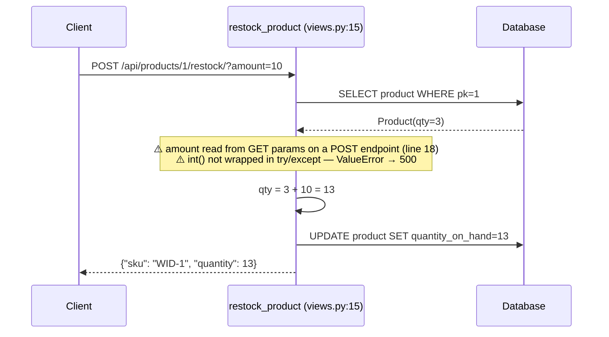
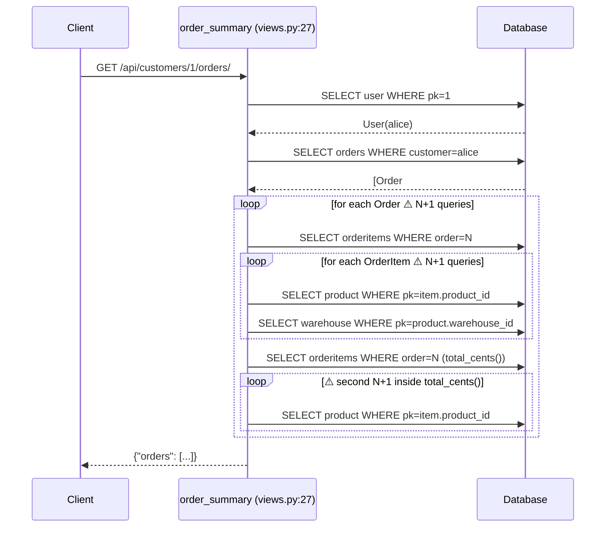
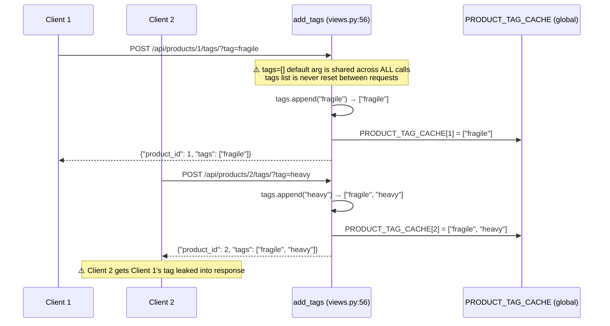
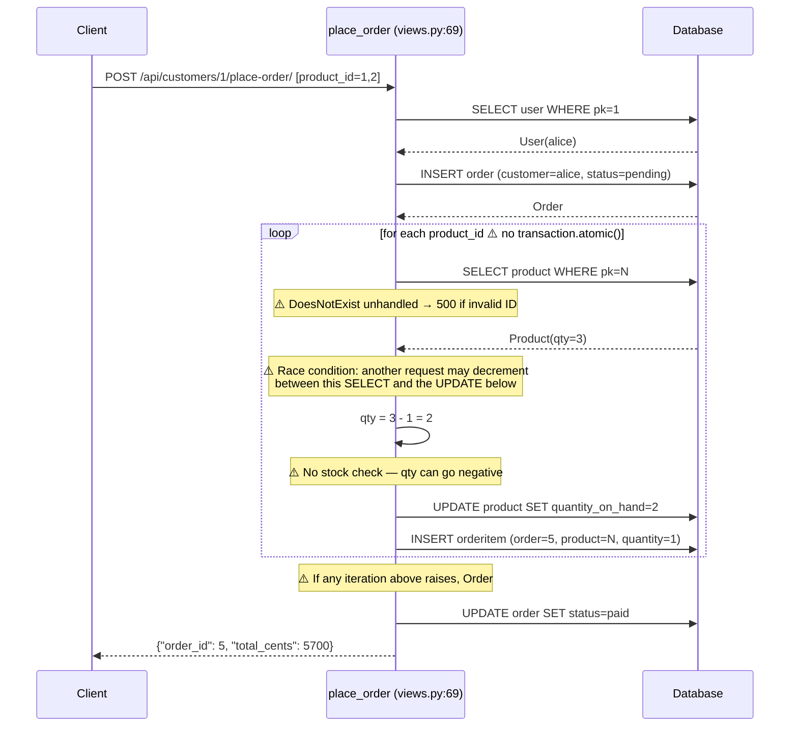
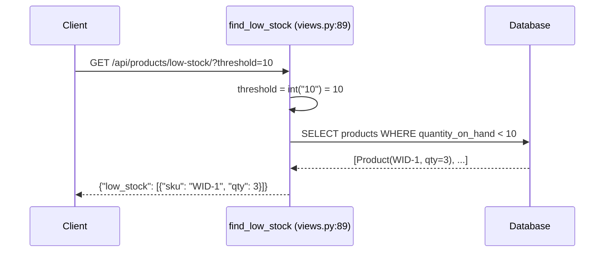
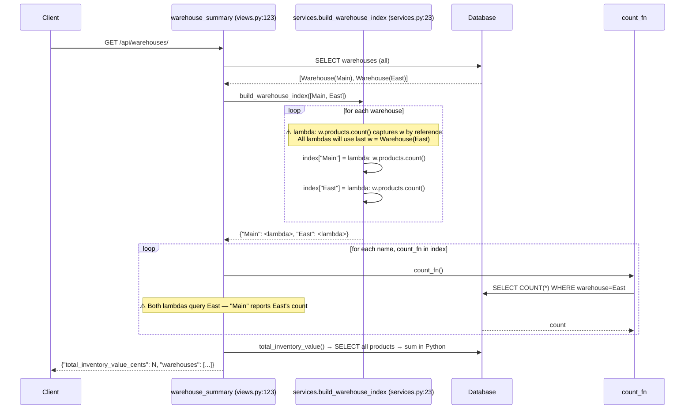
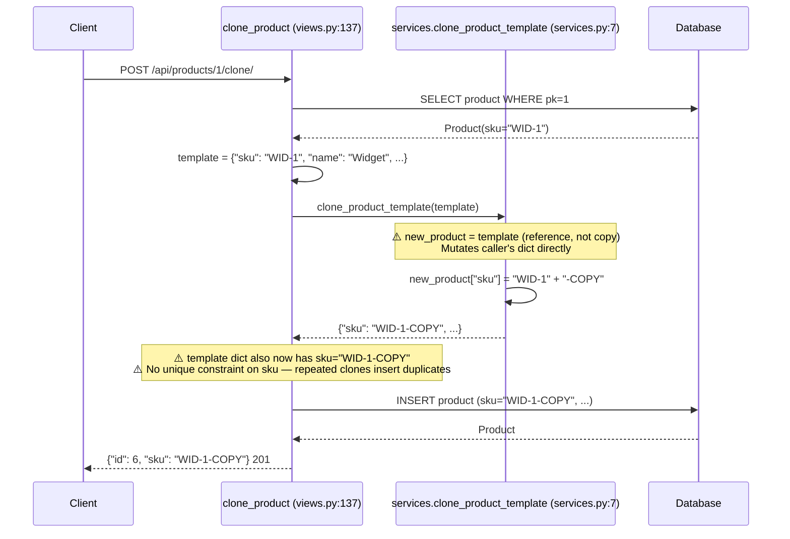
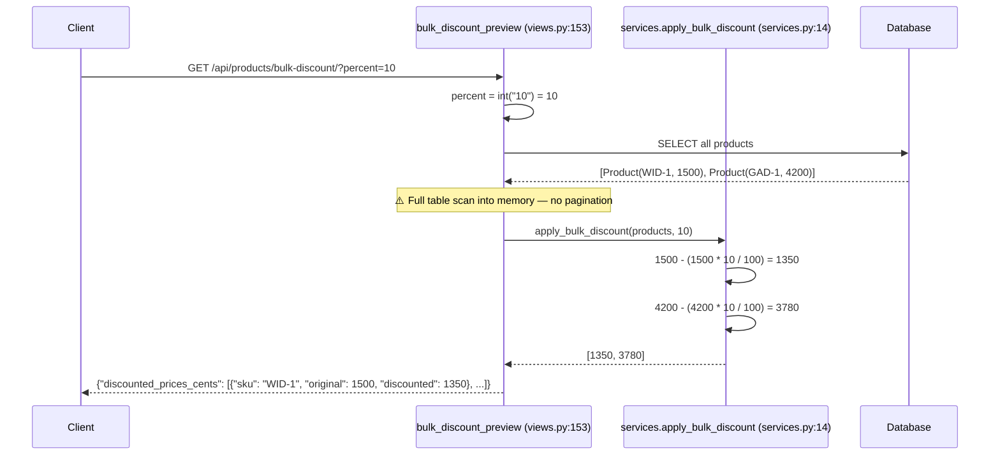

# Codebase Orientation Brief — Inventory Service

---

## 1. Key Entry Points

| File | Role |
|---|---|
| `manage.py` | Django CLI entry point (runserver, migrate, shell) |
| `config/urls.py` | Root URL router — mounts all API routes under `/api/` |
| `inventory/urls.py` | Route definitions for all 9 endpoints |
| `seed.py` | Dev database seeder — run via `python manage.py shell < seed.py` |

**API Endpoints**

```
POST   /api/products/<product_id>/restock/           restock_product
GET    /api/products/low-stock/                       find_low_stock
GET    /api/products/bulk-discount/                   bulk_discount_preview
POST   /api/products/<product_id>/tags/               add_tags
POST   /api/products/<product_id>/clone/              clone_product
GET    /api/customers/<customer_id>/orders/           order_summary
POST   /api/customers/<customer_id>/place-order/      place_order
DELETE /api/orders/<order_id>/cancel/                 cancel_order
GET    /api/warehouses/                               warehouse_summary
```

---

## 2. Key Functions — Hard Core of the Codebase

### `inventory/views.py`

| Function | Lines | Role |
|---|---|---|
| `restock_product` | 15–23 | Adds stock to a product. **BUG**: reads `amount` from `request.GET` (query string) on a POST endpoint — should be `request.POST`. No `try/except` around `int()`, so a non-integer `amount` raises an unhandled `ValueError` → 500. |
| `order_summary` | 27–52 | Returns all orders for a customer with line items. ⚠️ N+1: for each order iterates `items.all()`, then accesses `item.product` and `item.product.warehouse` — each a separate query. No `select_related`/`prefetch_related`. |
| `add_tags` | 56–62 | Appends a tag to an in-memory cache keyed by product ID. **BUG**: mutable default argument `tags=[]` (line 56) — all calls without an explicit `tags` arg share the same list object across requests; tags accumulate globally. |
| `place_order` | 69–85 | Creates an order and decrements stock per product. **BUG**: no `transaction.atomic()` — crash mid-loop leaves a pending order with partially decremented stock. **BUG**: no stock check before decrement, `quantity_on_hand` can go negative. **BUG**: uses bare `Product.objects.get(pk=pid)` — raises unhandled `DoesNotExist` → 500. ⚠️ Race condition: read-modify-write on `quantity_on_hand` with no DB-level lock. |
| `find_low_stock` | 89–104 | Filters products below a threshold. Correctly validates `threshold`. |
| `cancel_order` | 108–119 | Restores stock and deletes the order. **BUG**: `except Exception: pass` (line 116) silently swallows all errors; if the stock-restore loop fails halfway, partial state is committed and the caller still receives `{"cancelled": order_id}`. No `transaction.atomic()`. |
| `warehouse_summary` | 123–133 | Calls service layer for warehouse index and total value. ⚠️ Inherits the closure bug from `build_warehouse_index` (see services). |
| `clone_product` | 137–149 | Clones a product, appending `-COPY` to the SKU. **BUG**: `services.clone_product_template(template)` mutates the caller's `template` dict (see services). |
| `bulk_discount_preview` | 153–166 | Returns discounted prices for all products. ⚠️ Loads all products into memory — no pagination. |

### `inventory/services.py`

| Function | Lines | Role |
|---|---|---|
| `clone_product_template` | 7–11 | Returns a new product dict with `-COPY` appended to SKU. **BUG**: `new_product = template` is a reference assignment, not a copy — mutates the caller's original dict. Should use `copy.copy(template)` or `template.copy()`. The `import copy` at line 2 is unused. |
| `apply_bulk_discount` | 14–20 | Calculates discounted prices as a list of ints. Correct logic; returns prices in cents. |
| `build_warehouse_index` | 23–31 | Maps warehouse names to callables returning product counts. **BUG**: classic Python closure-in-loop capture — `lambda: w.products.count()` (line 30) captures `w` by reference. All lambdas resolve to the last warehouse in the iteration. Fix: `lambda w=w: w.products.count()`. |
| `total_inventory_value` | 34–39 | Sums `price_cents * quantity_on_hand` across all products. ⚠️ Loads all products into Python memory; could be a single `aggregate()` query. |

### `inventory/models.py`

| Function | Lines | Role |
|---|---|---|
| `Warehouse.__str__` | 9–10 | Returns warehouse name. |
| `Product.__str__` | 22–23 | Returns `"name (sku)"`. |
| `Order.total_cents` | 35–39 | Sums `price_cents * quantity` over all order items. ⚠️ N+1 if called outside a prefetch context. |

---

## 3. Class Hierarchy and Data Models

```
django.db.models.Model
├── Warehouse
│   ├── name          CharField(max_length=120)
│   └── location      CharField(max_length=255)
│
├── Product
│   ├── name          CharField(max_length=200)
│   ├── sku           CharField(max_length=64)        ⚠️ no unique=True — clones can duplicate SKUs
│   ├── price_cents   IntegerField(default=0)
│   ├── quantity_on_hand  IntegerField(default=0)
│   └── warehouse     ForeignKey(Warehouse, CASCADE, related_name="products")
│
├── Order
│   ├── customer      ForeignKey(User, CASCADE, related_name="orders")
│   ├── status        CharField(max_length=20, default="pending")
│   │                 choices: STATUS_PENDING / STATUS_PAID / STATUS_SHIPPED
│   ├── created_at    DateTimeField(auto_now_add=True)
│   └── total_cents() → int
│
└── OrderItem
    ├── order         ForeignKey(Order, CASCADE, related_name="items")
    ├── product       ForeignKey(Product, CASCADE)
    └── quantity      IntegerField(default=1)
```

**Entity Relationships**

```
Warehouse ──< Product ──< OrderItem >── Order >── User
```

---

## 4. Architectural Patterns

The project is a thin Django function-based-view REST API with a minimal service layer. There is no serialization framework (e.g. DRF), no authentication middleware, and no ORM query optimization. Views call services directly; services call models directly. Responses are hand-constructed `JsonResponse` dicts.

| Layer | Location | Description |
|---|---|---|
| URL routing | `config/urls.py`, `inventory/urls.py` | Two-level include; all endpoints under `/api/` |
| Views (controllers) | `inventory/views.py` | FBVs with `@require_http_methods` decorator |
| Service layer | `inventory/services.py` | Pure-Python helpers for reusable business logic |
| Models (ORM) | `inventory/models.py` | Django ORM models, no custom managers |
| Database | `db.sqlite3` | SQLite via Django's default backend |
| In-memory state | `PRODUCT_TAG_CACHE` (views.py:65) | Module-level dict — lost on restart, not thread-safe |

| Pattern | Observed |
|---|---|
| Function-based views | Yes |
| Service layer separation | Partial — some logic still lives in views |
| ORM models with relationships | Yes |
| Module-level global state | Yes (`PRODUCT_TAG_CACHE`) |

**Notable absent patterns**

- No authentication or authorization on any endpoint
- No serializers / input validation framework
- No `transaction.atomic()` on any write path
- No `select_related` / `prefetch_related` anywhere
- No pagination on list endpoints
- No test suite

---

## 5. Existing Tests

**No tests exist.**

| Area | Missing Tests |
|---|---|
| `restock_product` | Valid restock, negative amount, non-integer amount, missing product |
| `order_summary` | Customer with no orders, multiple orders, N+1 regression |
| `add_tags` | Mutable-default-arg isolation between requests |
| `place_order` | Out-of-stock prevention, partial failure rollback, concurrent orders |
| `find_low_stock` | Default threshold, custom threshold, invalid threshold |
| `cancel_order` | Stock restoration correctness, partial failure handling, already-deleted order |
| `warehouse_summary` | Correct warehouse-to-count mapping (closure bug regression) |
| `clone_product` | SKU mutation of original, duplicate SKU collision |
| `bulk_discount_preview` | Zero percent, 100 percent, invalid percent |
| `clone_product_template` | Input dict not mutated after call |
| `build_warehouse_index` | Each lambda returns its own warehouse's count, not the last one |
| Integration | Full place-order → cancel-order round-trip with stock balance check |
| Concurrency | Simultaneous place_order calls do not oversell a product |

---

## 6. Constraints and Assumptions

### Configuration Constraints

| Constraint | Location | Value / Risk |
|---|---|---|
| `SECRET_KEY` hardcoded | `config/settings.py:5` | Insecure key committed to repo; must be rotated before any production use |
| `DEBUG = True` | `config/settings.py:6` | Exposes stack traces to HTTP clients in any environment |
| `ALLOWED_HOSTS = ["*"]` | `config/settings.py:7` | Accepts requests from any host; enables Host-header injection |
| SQLite database | `config/settings.py:29–33` | Not suitable for concurrent write workloads; no row-level locking |
| No `CsrfViewMiddleware` | `config/settings.py:19–25` | CSRF middleware absent from stack — POST/DELETE endpoints unprotected |

### Code-Level Assumptions

| Assumption | Location | Detail |
|---|---|---|
| `product_id` values in `place_order` POST body are always valid integers referring to existing products | `views.py:77` | `Product.objects.get(pk=pid)` raises unhandled `DoesNotExist` if any ID is invalid |
| `amount` for restock arrives as a query-string integer | `views.py:18` | `int(request.GET.get("amount", 0))` raises unhandled `ValueError` on non-integer input; also POST body is ignored |
| Only one request modifies a product's stock at a time | `views.py:78–79`, `views.py:113–114` | No DB lock or `F()` expression; concurrent requests can read stale quantity and both decrement to the same value |
| The `template` dict passed into `clone_product_template` is disposable | `services.py:9` | Function mutates the caller's dict; callers in views.py do not expect mutation |
| Warehouse iteration order is stable across loop and lambda invocation | `services.py:29–31` | All lambdas capture the same final `w` due to late binding; wrong counts returned for all warehouses except the last |
| Tags persist across the process lifetime | `views.py:65` | `PRODUCT_TAG_CACHE` is module-level; any process restart wipes all tags silently |

---

## 7. Architecture Diagram

```
┌─────────────────────────────────────────────────────────────────┐
│                        HTTP Client                              │
└────────────────────────────┬────────────────────────────────────┘
                             │ HTTP Request
                             ▼
┌─────────────────────────────────────────────────────────────────┐
│                   Django WSGI / Dev Server                      │
│                      (manage.py runserver)                      │
└────────────────────────────┬────────────────────────────────────┘
                             │
                             ▼
┌─────────────────────────────────────────────────────────────────┐
│                   config/urls.py                                │
│               path("api/", include("inventory.urls"))           │
└────────────────────────────┬────────────────────────────────────┘
                             │
                             ▼
┌─────────────────────────────────────────────────────────────────┐
│                  inventory/urls.py                              │
│         9 route patterns → view function dispatch               │
└────────────────────────────┬────────────────────────────────────┘
                             │
                             ▼
┌─────────────────────────────────────────────────────────────────┐
│                   inventory/views.py                            │
│  restock_product │ order_summary │ add_tags │ place_order       │
│  find_low_stock  │ cancel_order  │ warehouse_summary            │
│  clone_product   │ bulk_discount_preview                        │
│                                                                 │
│  ┌─────────────────────┐                                        │
│  │  PRODUCT_TAG_CACHE  │  ← module-level dict (in-memory only) │
│  └─────────────────────┘                                        │
└────────┬───────────────────────────┬────────────────────────────┘
         │ calls                     │ direct ORM calls
         ▼                           ▼
┌─────────────────────┐   ┌──────────────────────────────────────┐
│  inventory/         │   │          inventory/models.py          │
│  services.py        │   │  Warehouse │ Product │ Order │        │
│                     │   │  OrderItem │ django.contrib.auth.User │
│  clone_product_     │   └──────────────────┬───────────────────┘
│  template           │                      │ Django ORM
│  apply_bulk_        │                      ▼
│  discount           │   ┌──────────────────────────────────────┐
│  build_warehouse_   │   │           db.sqlite3                 │
│  index              │   │  (tables: warehouse, product,        │
│  total_inventory_   │   │   order, orderitem, auth_user)       │
│  value              │   └──────────────────────────────────────┘
└─────────────────────┘
```

---

## 8. Mermaid Sequence Diagrams — All Application Flows

### Flow A — `POST /api/products/<id>/restock/`



### Flow B — `GET /api/customers/<id>/orders/`



### Flow C — `POST /api/products/<id>/tags/`



### Flow D — `POST /api/customers/<id>/place-order/`



### Flow E — `GET /api/products/low-stock/`



### Flow F — `DELETE /api/orders/<id>/cancel/`

```mermaid
sequenceDiagram
    participant C as Client
    participant V as cancel_order (views.py:108)
    participant DB as Database

    C->>V: DELETE /api/orders/5/cancel/
    V->>DB: SELECT order WHERE pk=5
    DB-->>V: Order#5

    loop for each OrderItem  ⚠️ no transaction.atomic()
        V->>DB: SELECT product (via item.product)
        V->>V: product.quantity_on_hand += item.quantity
        V->>DB: UPDATE product SET quantity_on_hand=N
        Note over V: ⚠️ If UPDATE fails here, subsequent items are<br/>not restored; exception is silently swallowed (line 116)
    end

    V->>DB: DELETE order WHERE pk=5
    Note over V: ⚠️ Returns {"cancelled": 5} even if stock restoration<br/>failed mid-loop due to bare except: pass
    V-->>C: {"cancelled": 5}
```

### Flow G — `GET /api/warehouses/`



### Flow H — `POST /api/products/<id>/clone/`



### Flow I — `GET /api/products/bulk-discount/`



---

## Critical Issues Summary

| Priority | Issue | Location |
|---|---|---|
| P0 | **Race condition on stock decrement** — concurrent `place_order` calls read the same `quantity_on_hand` and both decrement, allowing overselling. Fix: use `F()` expression or `select_for_update()` inside `transaction.atomic()`. | `views.py:78–79` |
| P0 | **No `transaction.atomic()` on write paths** — `place_order` and `cancel_order` both leave the database in inconsistent state on partial failure. | `views.py:69–85`, `views.py:108–119` |
| P0 | **Silent exception swallowing in `cancel_order`** — `except Exception: pass` hides errors, returns success to caller even when stock restoration failed. | `views.py:116–117` |
| P1 | **Closure capture bug in `build_warehouse_index`** — all warehouse lambdas resolve to the last warehouse in the loop; every warehouse reports the wrong product count. | `services.py:29–31` |
| P1 | **Mutable default argument `tags=[]` in `add_tags`** — tags leak across all requests for different products; the list grows unboundedly until process restart. | `views.py:56` |
| P1 | **`clone_product_template` mutates caller's dict** — `new_product = template` is a reference, not a copy; mutates the `template` dict in `clone_product` view. | `services.py:9` |
| P1 | **No authentication on any endpoint** — any unauthenticated client can place orders, cancel orders, restock products, or clone products. | All views |
| P2 | **`restock_product` reads `amount` from GET params on a POST endpoint** — body params are ignored; `int()` not guarded → 500 on bad input. | `views.py:18` |
| P2 | **`place_order` does not check stock before decrementing** — `quantity_on_hand` can go negative without constraint or error. | `views.py:78` |
| P2 | **N+1 queries in `order_summary` and `Order.total_cents()`** — each order and item triggers separate DB queries; no `select_related`/`prefetch_related`. | `views.py:33–49`, `models.py:35–39` |
| P2 | **Unhandled `Product.DoesNotExist` in `place_order`** — bare `.get()` raises on invalid product ID → 500 instead of 404. | `views.py:77` |
| P3 | **No `unique=True` on `Product.sku`** — repeated calls to `clone_product` generate colliding SKUs without error. | `models.py:15` |
| P3 | **Hardcoded insecure `SECRET_KEY`, `DEBUG=True`, `ALLOWED_HOSTS=["*"]`** — unsafe for any non-local environment. | `config/settings.py:5–7` |
| P3 | **`PRODUCT_TAG_CACHE` is in-memory module-level state** — not shared across processes, lost on restart, not thread-safe under concurrent writes. | `views.py:65` |
